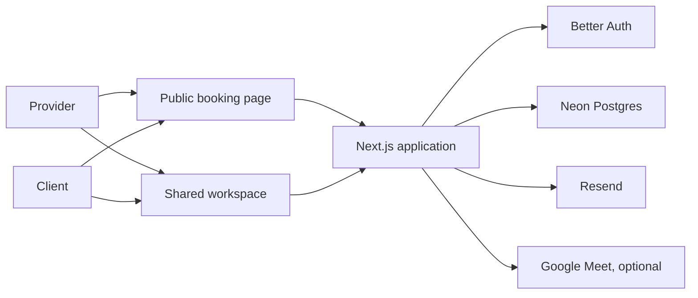

# PeerSlot

Appointment scheduling for professionals and the people they serve.

PeerSlot gives appointment-based professionals a public booking page, a clear workspace, and scheduling rules that stay in their control. Clients can choose an available time, receive status updates, and reschedule or cancel when the provider's policy allows it.

PeerSlot works for tutoring, coaching, consulting, training, therapy practices, and other appointment-based services. The product uses **provider** for the person offering appointments and **client** for the person booking or attending one. A single account can host appointments and attend appointments with another provider.

## What is in the product

### Public booking

- A provider creates and publishes one localized booking page.
- Clients see the provider's name, professional title, time zone, duration, and available times.
- A client can book as a new or returning account and receives clear pending or confirmed status.
- The server checks availability, notice periods, conflicts, and booking ownership before saving a request.

### Shared workspace

- **My appointments** is a chronological list for appointments a person hosts or attends.
- **Calendar** shows availability, confirmed sessions, recurring sessions, and personal activities.
- **Requests** lets providers accept or decline pending bookings.
- **Clients** keeps provider-managed client records separate from appointment attendees.
- **Personal activities** block time for work such as lunch, travel, or prayer without changing session rest rules.
- **Settings** controls booking-page rules, minimum notice, the weekly client reschedule limit, and optional Google Meet connection.
- Account settings include profile picture, language, date and time preferences, account export, and deletion.

### Scheduling rules

Providers control appointment duration, booking interval, rest between sessions, minimum notice, time zone, publication, and the weekly client reschedule limit. The notice period is checked against the original appointment when a client reschedules. The replacement can be an earlier available time when the existing appointment is still eligible.

All shared scheduling writes are authorized on the server. Database constraints and transactional checks prevent double booking and protect concurrent requests. Appointment times are stored as UTC instants and displayed in the relevant provider or account time zone.

### Notifications and meetings

PeerSlot sends transactional account and appointment emails through Resend when email delivery is configured. Confirmed online appointments can receive a Google Meet link after the provider connects Google Meet. See [email deliverability](docs/email-deliverability.md) and [Google Meet setup](docs/google-meet.md) before enabling those services in production.

## Product status

The scheduling workflow is implemented and is suitable for a controlled beta. Complete the [launch-readiness checklist](docs/launch-readiness.md) before paid acquisition or a public commercial launch. Billing and subscriptions are not included in the application yet; the commercial decisions and required external setup are documented in [commercial readiness](docs/commercial-readiness.md).

## Localization and public routes

The website is available in English at `/en` and Turkish at `/tr`. The root route selects a locale and redirects to the matching localized page. API routes remain under `/api` without a locale prefix.

Public pages include:

- `/{locale}` for the marketing homepage
- `/{locale}/book/{slug}` for a published provider booking page
- `/{locale}/policy/terms-agreements`
- `/{locale}/policy/privacy`
- `/{locale}/policy/cookies`

Authenticated pages use the shared workspace layout. Legacy provider paths remain redirected where compatibility is needed. Private dashboard routes are excluded from the sitemap and search crawling.

## Architecture

PeerSlot is a modular Next.js monolith. The App Router renders localized pages, route handlers enforce authorization and scheduling rules, and Neon Postgres stores durable application state.



There is no separate microservice backend. Keeping the product in one TypeScript codebase keeps scheduling rules close to the UI and database operations.

## Tech stack

| Area | Technology |
| --- | --- |
| Framework | [Next.js 16](https://nextjs.org/) App Router |
| Language | [TypeScript](https://www.typescriptlang.org/) |
| UI runtime | [React 19](https://react.dev/) |
| Styling | [Tailwind CSS 4](https://tailwindcss.com/) |
| Localization | [next-intl](https://next-intl.dev/) |
| Database | [Neon Postgres](https://neon.com/) |
| ORM | [Drizzle ORM](https://orm.drizzle.team/) |
| Authentication | [Better Auth](https://www.better-auth.com/) |
| Email | [Resend](https://resend.com/), optional |
| Meetings | [Google Meet REST API](https://developers.google.com/meet/api/guides/overview), optional |
| Package manager | [pnpm](https://pnpm.io/) |

## Getting started

### Prerequisites

- Node.js 20 or newer
- pnpm 10 or newer
- A Neon Postgres branch for local development

### Install and run

```bash
git clone <repository-url>
cd peerslot
pnpm install
cp .env.example .env.local
pnpm dev
```

Open [http://localhost:3000](http://localhost:3000). Provider onboarding is available at `http://localhost:3000/en/auth/provider`. A local provider can create a profile, booking page, availability, and test appointments without enabling email or Google Meet.

Set `BETTER_AUTH_URL` and `NEXT_PUBLIC_SITE_URL` to the local URL during development. Keep secrets in `.env.local`; never commit them. Production and preview environment separation is described in [docs/vercel-environments.md](docs/vercel-environments.md).

### Environment services

The minimum local configuration is:

- `DATABASE_URL` for the development Neon branch
- `BETTER_AUTH_SECRET` with at least 32 random characters
- `BETTER_AUTH_URL` and `NEXT_PUBLIC_SITE_URL`

Add Resend variables for real verification and appointment emails. Add the Google Meet variables and configure the OAuth client before testing automatic meeting links. Add the Neon object-storage variables before testing profile pictures. The complete list is in [.env.example](.env.example).

## Useful commands

| Command | Purpose |
| --- | --- |
| `pnpm dev` | Start the development server |
| `pnpm build` | Create a production build |
| `pnpm start` | Run the production build |
| `pnpm lint` | Run ESLint |
| `pnpm typecheck` | Run TypeScript without emitting files |
| `pnpm test` | Run the Vitest suite |
| `pnpm auth:schema` | Regenerate the Better Auth schema |
| `pnpm db:generate` | Generate a Drizzle migration |
| `pnpm db:migrate` | Apply pending migrations |
| `pnpm db:studio` | Open Drizzle Studio |
| `pnpm user:grant-provider <email>` | Grant provider capability in a local database |

Run `pnpm lint`, `pnpm typecheck`, `pnpm test`, and `pnpm build` before every release. Use a separate preview database branch and run the browser smoke tests listed in [docs/launch-readiness.md](docs/launch-readiness.md).

## Documentation

- [Launch readiness](docs/launch-readiness.md)
- [Commercial readiness](docs/commercial-readiness.md)
- [Google Meet setup](docs/google-meet.md)
- [Email deliverability](docs/email-deliverability.md)
- [Rescheduling rules](docs/rescheduling.md)
- [Vercel environment separation](docs/vercel-environments.md)
- [API testing](docs/API_TESTING.md)

## Product boundaries

PeerSlot is a scheduling tool. It does not provide tutoring, coaching, therapy, healthcare, legal, financial, or other professional services. Providers remain responsible for the relationship with their clients, the accuracy of their availability, and any consent or record-keeping obligations that apply to their work.

The current product does not include subscription billing, organization workspaces, native mobile apps, or automatic calendar synchronization. Do not describe those as available until the corresponding workflows and operational controls are released.

## License

No open-source license has been selected. Unless a license is added, all rights are reserved.
